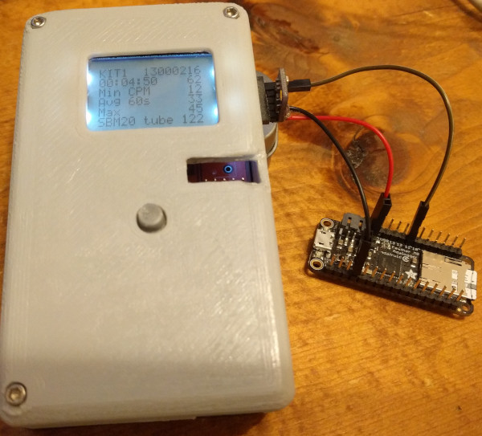
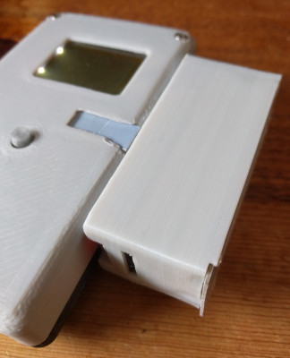
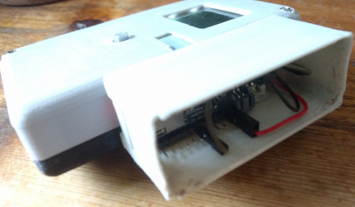

# Serial-AdaLogger

Log an asynchronous serial stream to SD with an 
[Adalogger](https://learn.adafruit.com/adafruit-feather-m0-adalogger/)

I use this to log CSV output from the 
[uRADMonitor](https://github.com/ec1oud/uradmonitor_kit1).

Includes a design for a "sidecar" box to mount it to the case I designed
for the uradmonitor kit1.

